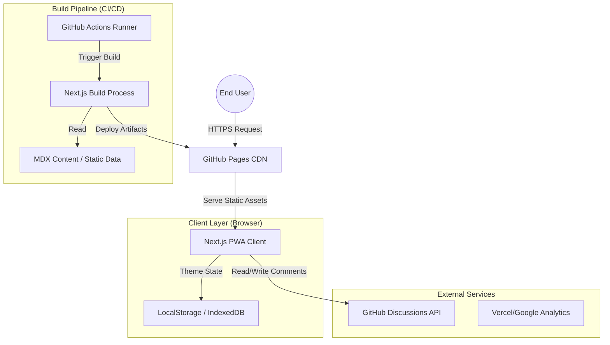
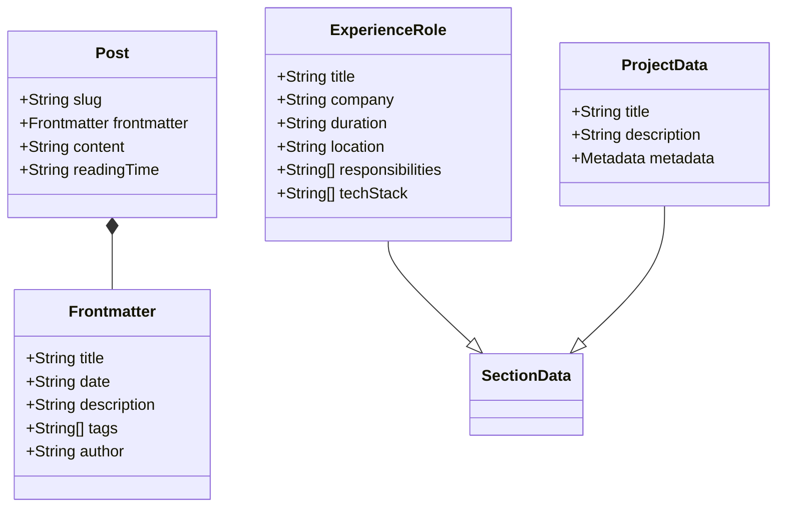
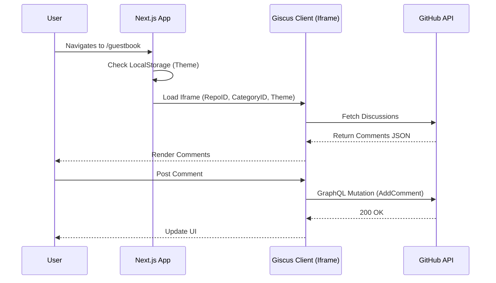

# System Architecture & Design Specification (azhagu-swe.github.io)

**Version:** 1.0.0  
**Author:** Principal Architect Team (AI)  
**Date:** 2026-02-13

---

## 1. High-Level Design (HLD)

### 1.1 Architectural Overview
The system follows a **Jamstack (JavaScript, APIs, and Markup)** architecture, leveraging Next.js 16 (App Router) for static site generation (SSG). This ensures maximum performance, security, and scalability by pre-rendering content at build time and serving it via a Content Delivery Network (CDN) - specifically GitHub Pages.

### 1.2 System Context Diagram

### 1.3 Scalability Strategy
-   **Horizontal Scaling:** Effectively infinite. Traffic is handled by GitHub's global CDN edge network. The origin server (GitHub Actions runner) is only involved during build/deployment, not request serving.
-   **Load Balancing:** Handled transparently by the CDN provider (Fastly/GitHub) using Anycast DNS routing to the nearest PoP (Point of Presence).
-   **Content Delivery:** Aggressive caching strategies with long TTLs for immutable assets (hashed JS/CSS chunks) and ETags for validation.

---

## 2. Low-Level Design (LLD)

### 2.1 Core Data Structures
The application uses a file-based CMS approach. Data is structured via TypeScript interfaces ensuring type safety across the application.

### 2.2 User Workflow: Commenting System (Giscus)
The interaction with the Giscus comment system involves a cross-origin iframe security model.

### 2.3 Internal API Definitions
Although the compiled output is static HTML, the build process treats local files as an API.

| Endpoint (Internal Function) | Input | Output | Description |
| :--- | :--- | :--- | :--- |
| `getAllPosts(type)` | `string` ('blog', 'projects') | `Post[]` | Reads MDX from filesystem, parses frontmatter, sorts by date. |
| `getPostBySlug(type, slug)` | `string`, `string` | `Post` | Retrieves single post content and compiles MDX to React nodes. |
| `getRelatedPosts(currentPost)` | `Post` | `Post[]` | Implements Jaccard Similarity Index on tags to find relevant content. |

---

## 3. Infrastructure & DevOps

### 3.1 CI/CD Pipeline
The project utilizes **GitHub Actions** for continuous integration and delivery.

1.  **Trigger:** Push to `main` branch.
2.  **Job 1: Build**
    -   Checkout Code.
    -   Setup Node.js (Latest LTS).
    -   Install Dependencies (`npm ci` for deterministic builds).
    -   Linting & Type Checking.
    -   `npm run build` (Next.js Static Export).
3.  **Job 2: Deploy**
    -   Upload Artifacts (`out/` directory).
    -   Deploy to GitHub Pages environment.

### 3.2 Hosting Strategy
-   **Platform:** GitHub Pages.
-   **Domain:** `azhagu-swe.github.io` (User Site).
-   **SSL/TLS:** Managed automatically by GitHub (Let's Encrypt).
-   **Asset Compression:** Brotli/Gzip enforced by CDN.

---

## 4. Risk Analysis & Trade-offs

| Risk Area | Potential Issue | Mitigation Strategy | Status |
| :--- | :--- | :--- | :--- |
| **Search Engine Optimization** | PWA/SPA client-side routing can confuse crawlers. | **Mitigated:** using specific `sitemap.xml`, `robots.txt`, and correctly implemented `metadataBase` for OpenGraph. | ✅ Low Risk |
| **Build Time** | Static generation time increases linearly with content. | **Accepted Trade-off:** For a portfolio (<1000 pages), build times remain negligible (<2 mins). Incremental Static Regeneration (ISR) is not available on GH Pages. | ⚠️ Monitor |
| **Dynamic Features** | No backend means no API routes (e.g., form handling). | **Mitigated:** Shift to client-side APIs (Giscus, Formspree) or Serverless Functions (Vercel) if needed in future. | ✅ Managed |
| **SEO Ranking** | "Duplicate Content" if canonicals aren't set. | **Mitigated:** Canonical URLs are auto-generated via `metadataBase` in `layout.tsx`. | ✅ Low Risk |

---

**End of Specification**
