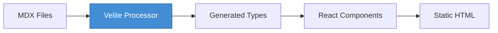

# API Specification

**Project:** Azhagu-swe Portfolio  
**Version:** 1.0.0  
**Last Updated:** 2026-02-20

---

## 1. Overview

This document describes the internal content API, external service integrations, and error handling conventions for the portfolio application.

### 1.1 API Architecture

The application uses a **file-based content API** where MDX files serve as the data source. Content is processed at build time by Velite and exposed as typed TypeScript objects.



---

## 2. Internal Content API

### 2.1 Content Functions

Located in `lib/mdx.ts`

#### 2.1.1 `getAllPosts(type)`

Retrieves all published posts of a specified type.

```typescript
/**
 * Get all published posts of a specific type
 * @param type - Content type ('blog' | 'projects')
 * @returns Array of posts sorted by date (descending)
 */
function getAllPosts(type: 'blog' | 'projects'): Post[]
```

**Response Schema:**

```typescript
interface Post {
  slug: string;
  frontmatter: {
    title: string;
    description: string;
    date: string;        // ISO 8601 format: YYYY-MM-DD
    tags: string[];
    author: string;
    draft: boolean;
    coverImage?: string;
  };
  content: string;
  readingTime: number;   // Minutes
}
```

**Example Usage:**

```typescript
import { getAllPosts } from '@/lib/mdx';

const posts = getAllPosts('blog');
// Returns: [{ slug: 'my-post', frontmatter: {...}, content: '...', readingTime: 5 }]
```

---

#### 2.1.2 `getPostBySlug(type, slug)`

Retrieves a single post by its slug identifier.

```typescript
/**
 * Get a single post by slug
 * @param type - Content type ('blog' | 'projects')
 * @param slug - Post slug (e.g., 'my-first-post')
 * @returns Post object or undefined if not found
 */
function getPostBySlug(
  type: 'blog' | 'projects',
  slug: string
): Post | undefined
```

**Example Usage:**

```typescript
const post = getPostBySlug('blog', 'my-first-post');
if (!post) {
  notFound(); // Next.js 404 handler
}
```

---

#### 2.1.3 `getRelatedPosts(currentPost, allPosts, limit)`

Finds related posts using Jaccard similarity on tags.

```typescript
/**
 * Get related posts based on tag similarity
 * @param currentPost - The reference post
 * @param allPosts - All available posts for comparison
 * @param limit - Maximum number of related posts to return (default: 3)
 * @returns Array of related posts with similarity score
 */
function getRelatedPosts(
  currentPost: Post,
  allPosts: Post[],
  limit?: number
): Array<Post & { similarity: number }>
```

**Algorithm:** Jaccard Similarity Index

```
Similarity(A, B) = |A ∩ B| / |A ∪ B|
```

**Example Usage:**

```typescript
const related = getRelatedPosts(currentPost, allPosts, 3);
// Returns: [{ ...post, similarity: 0.67 }, ...]
```

---

#### 2.1.4 `getReadingTime(content)`

Calculates estimated reading time for content.

```typescript
/**
 * Calculate reading time in minutes
 * @param content - Markdown/MDX content string
 * @returns Reading time in minutes (rounded up)
 */
function getReadingTime(content: string): number
```

**Formula:** 200 words per minute (average reading speed)

---

### 2.2 Generated Content Types

Velite generates TypeScript types from MDX frontmatter. Located in `.velite/index.ts` (auto-generated).

```typescript
// Auto-generated by Velite
interface Blog {
  slug: string;
  title: string;
  description: string;
  date: number;          // Unix timestamp
  tags: string[];
  author: string;
  draft: boolean;
  coverImage?: string;
  content: string;
  readingTime: number;
}

interface Project {
  slug: string;
  title: string;
  description: string;
  date: number;
  tags: string[];
  demoUrl?: string;
  repoUrl?: string;
  coverImage?: string;
  content: string;
}
```

---

## 3. External Service APIs

### 3.1 Giscus Comments API

**Service:** [giscus.app](https://giscus.app)  
**Type:** Client-side iframe + postMessage API  
**Authentication:** GitHub OAuth (handled by Giscus)

#### 3.1.1 Configuration

```typescript
interface GiscusConfig {
  repo: string;                    // "owner/repo"
  repoId: string;                  // "R_kgDO..."
  categoryId: string;              // "DIC_kwDO..."
  mapping: 'pathname' | 'url' | 'title' | 'og:title';
  theme: 'light' | 'dark' | 'dark_dimmed' | 'preferred_color_scheme';
  reactionsEnabled: '1' | '0';
  inputPosition: 'top' | 'bottom';
}
```

#### 3.1.2 postMessage API

Send messages to the Giscus iframe:

```typescript
const iframe = document.querySelector('iframe.giscus-frame');
iframe?.contentWindow?.postMessage(
  { giscus: { setConfig: { theme: 'dark' } } },
  'https://giscus.app'
);
```

**Supported Messages:**

| Message | Payload | Description |
| :--- | :--- | :--- |
| `setConfig` | `{ theme: string }` | Change theme dynamically |
| `setConfig` | `{ repo: string }` | Switch repository (advanced) |

---

### 3.2 GitHub Pages CDN

**Service:** [pages.github.com](https://pages.github.com)  
**Type:** Static asset hosting  
**Deployment:** GitHub Actions

#### 3.2.1 Asset URLs

| Asset Type | URL Pattern | Cache TTL |
| :--- | :--- | :--- |
| HTML | `/{page}.html` | 0 (no-cache) |
| CSS | `/_next/static/css/{hash}.css` | 31536000 (1 year) |
| JavaScript | `/_next/static/chunks/{hash}.js` | 31536000 (1 year) |
| Images | `/images/{path}` | 86400 (1 day) |
| Fonts | `/fonts/{path}` | 31536000 (1 year) |

---

### 3.3 Analytics API (Optional)

**Service:** Google Analytics 4 / Vercel Analytics  
**Type:** Client-side script injection

#### 3.3.1 Configuration

```typescript
// lib/analytics.ts
export const analyticsConfig = {
  gaId: process.env.NEXT_PUBLIC_ANALYTICS_ID,
  vercelId: process.env.NEXT_PUBLIC_VERCEL_ANALYTICS_ID,
  enabled: process.env.NODE_ENV === 'production',
};
```

#### 3.3.2 Events Tracked

| Event | Trigger | Properties |
| :--- | :--- | :--- |
| `page_view` | Route change | `page_path`, `page_title` |
| `theme_change` | Theme toggle | `theme: 'light' | 'dark'` |
| `search` | Command palette use | `query: string` |
| `comment_load` | Giscus iframe load | `page_path` |

---

## 4. Error Codes

### 4.1 Build-Time Errors

| Code | Message | Cause | Resolution |
| :--- | :--- | :--- | :--- |
| `BUILD_001` | `Frontmatter validation failed` | Invalid MDX frontmatter schema | Check frontmatter fields against Zod schema in `lib/schemas.ts` |
| `BUILD_002` | `MDX compilation error` | Syntax error in MDX content | Verify Markdown syntax; check for unclosed JSX tags |
| `BUILD_003` | `Image not found: {path}` | Referenced image doesn't exist | Ensure image exists in `public/images/` directory |
| `BUILD_004` | `Duplicate slug: {slug}` | Two posts have the same slug | Rename one of the conflicting MDX files |
| `BUILD_005` | `Type generation failed` | Velite configuration error | Review `velite.config.ts` for syntax errors |

---

### 4.2 Runtime Errors

| Code | Message | Cause | Resolution |
| :--- | :--- | :--- | :--- |
| `RUNTIME_001` | `Failed to load Giscus` | Invalid Giscus credentials | Verify `NEXT_PUBLIC_GISCUS_*` environment variables |
| `RUNTIME_002` | `Theme hydration mismatch` | Server/client theme mismatch | Ensure `suppressHydrationWarning` on `<html>` element |
| `RUNTIME_003` | `404: Page not found` | Invalid route or deleted content | Check `app/` directory for route existence |
| `RUNTIME_004` | `Failed to load MDX content` | Content file missing or corrupted | Verify MDX file exists in `content/` directory |
| `RUNTIME_005` | `Command palette failed to load` | `cmdk` library error | Reinstall dependencies: `npm install` |

---

### 4.3 Network Errors

| Code | Message | Cause | Resolution |
| :--- | :--- | :--- | :--- |
| `NET_001` | `Failed to fetch Giscus discussions` | GitHub API rate limit | Wait for rate limit reset; reduce comment widget loads |
| `NET_002` | `CDN asset load failed` | Corrupted cache or network issue | Clear browser cache; check network connectivity |
| `NET_003` | `Font load timeout` | Slow CDN or blocked request | Verify font files in `public/fonts/`; check CSP headers |

---

### 4.4 Error Handling Patterns

#### Client-Side Error Boundary

```typescript
// components/error-boundary.tsx
export class ErrorBoundary extends React.Component {
  state = { hasError: false };

  static getDerivedStateFromError() {
    return { hasError: true };
  }

  render() {
    if (this.state.hasError) {
      return <FallbackUI />;
    }
    return this.props.children;
  }
}
```

#### Async Error Handling

```typescript
// lib/mdx.ts
export function getPostBySlug(type: string, slug: string): Post {
  try {
    const post = /* fetch logic */;
    if (!post) {
      throw new ContentError(`Post not found: ${slug}`, 'CONTENT_001');
    }
    return post;
  } catch (error) {
    logError(error);
    throw error;
  }
}
```

---

## 5. Rate Limits

### 5.1 External Service Limits

| Service | Limit | Window | Notes |
| :--- | :--- | :--- | :--- |
| **Giscus (GitHub API)** | 5,000 requests | 1 hour | Per authenticated user |
| **GitHub Pages** | 100 GB | 1 month | Bandwidth limit (soft) |
| **GitHub Actions** | 2,000 minutes | 1 month | Free tier (private repos) |

### 5.2 Recommended Throttling

```typescript
// lib/rate-limit.ts
const RATE_LIMIT = {
  giscus: { max: 10, window: 60000 },  // 10 requests per minute
  analytics: { max: 100, window: 60000 }, // 100 events per minute
};
```

---

## 6. Data Validation

### 6.1 Frontmatter Schema (Zod)

```typescript
// lib/schemas.ts
import { z } from 'zod';

export const blogSchema = z.object({
  title: z.string().min(1).max(100),
  description: z.string().min(1).max(300),
  date: z.string().regex(/^\d{4}-\d{2}-\d{2}$/),
  tags: z.array(z.string()).max(10),
  author: z.string().default('Alagappan P'),
  draft: z.boolean().default(false),
  coverImage: z.string().url().optional(),
});

export type BlogFrontmatter = z.infer<typeof blogSchema>;
```

### 6.2 Validation Errors

| Field | Error | Message |
| :--- | :--- | :--- |
| `title` | `too_small` | "Title is required (min 1 character)" |
| `title` | `too_big` | "Title must be under 100 characters" |
| `description` | `too_small` | "Description is required" |
| `description` | `too_big` | "Description must be under 300 characters" |
| `date` | `invalid_string` | "Date must be in YYYY-MM-DD format" |
| `tags` | `too_big` | "Maximum 10 tags allowed" |
| `coverImage` | `invalid_string` | "Cover image must be a valid URL" |

---

## 7. Webhooks (CI/CD)

### 7.1 GitHub Actions Triggers

| Event | Workflow | Description |
| :--- | :--- | :--- |
| `push:main` | `deploy.yml` | Build and deploy to GitHub Pages |
| `pull_request` | `ci.yml` | Run linting, type checking, and tests |
| `workflow_dispatch` | `deploy.yml` | Manual deployment trigger |

### 7.2 Webhook Payload

```json
{
  "action": "opened",
  "ref": "refs/heads/main",
  "repository": {
    "full_name": "azhagu-swe/azhagu-swe.github.io",
    "html_url": "https://github.com/azhagu-swe/azhagu-swe.github.io"
  },
  "sender": {
    "login": "alagu-swe",
    "type": "User"
  }
}
```

---

## 8. API Changelog

| Version | Date | Changes |
| :--- | :--- | :--- |
| 1.0.0 | 2026-02-20 | Initial API specification |
| | | - Internal content API (Velite) |
| | | - Giscus integration |
| | | - Error code reference |

---

**See Also:**
- [Setup Guide](./SETUP.md)
- [Design Details](./DESIGN_DETAILS.md)
- [Velite Documentation](https://velite.js.org/)
- [Giscus API Reference](https://github.com/giscus/giscus/blob/main/ADVANCED.md)
