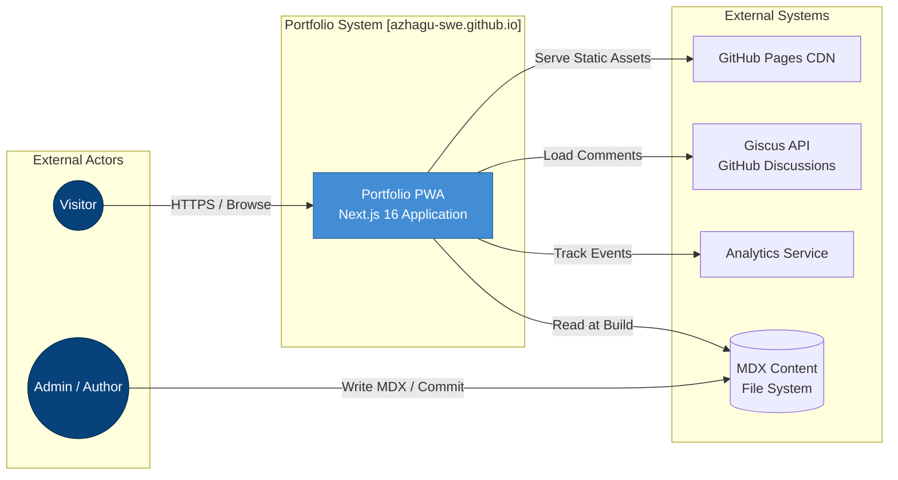
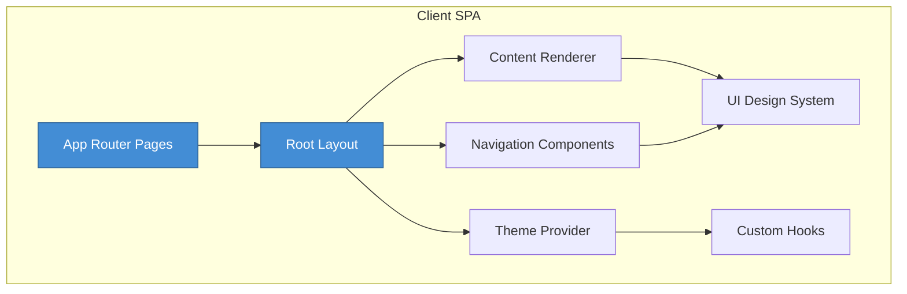
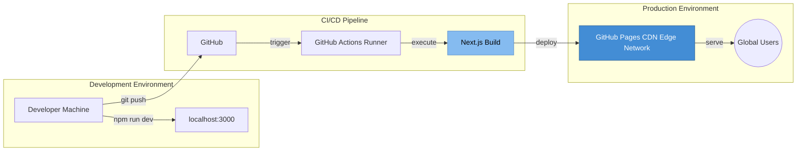

# System Architecture

**Project:** Azhagu-swe Portfolio  
**Version:** 1.0.0  
**Last Updated:** 2026-02-20  
**Architect:** Alagappan P

---

## 1. System Context (C4 Level 1)

This diagram illustrates how the portfolio system interacts with external actors and systems.



### 1.1 Person Descriptions

| Actor | Description |
| :--- | :--- |
| **Visitor** | End users browsing the portfolio, reading blog posts, viewing projects, or interacting with the guestbook. |
| **Admin / Author** | The site owner who creates and maintains MDX content (blog posts, projects) via Git commits. |

### 1.2 External System Descriptions

| System | Description |
| :--- | :--- |
| **GitHub Pages CDN** | Static hosting platform that serves pre-built HTML, CSS, JS, and assets globally via edge caching. |
| **Giscus API** | GitHub Discussions-backed commenting system loaded via iframe for guestbook interactions. |
| **Analytics Service** | Optional telemetry provider for tracking page views and user engagement metrics. |
| **MDX Content (File System)** | Local file-based CMS where blog posts and project data are stored as Markdown with JSX. |

---

## 2. Container Diagram (C4 Level 2)

This diagram shows the high-level technical building blocks within the portfolio system.

```mermaid
containerDiagram
    boundary "Portfolio System Boundary" {
        Container_Browser(Client SPA, "React 19 + TypeScript", "Browser")
        Container_Build(Build Pipeline, "Next.js 16 + Velite", "GitHub Actions CI")
    }

    Rel(Visitor, Container_Browser, "HTTPS / Browse", "Browser")
    Rel(Admin, Container_Build, "git push", "HTTPS")

    Container_Browser --> Container_Build : "Static Assets (HTML/CSS/JS)"
    Container_Build --> FileSystem : "Read MDX"
    Container_Build --> GitHub : "Deploy"

    boundary "External Systems" {
        Container_External_GitHub[GitHub Pages CDN]
        Container_External_Giscus[Giscus API]
        Container_External_FS[(MDX Files)]
    }

    Rel(Container_Browser, Container_External_GitHub, "Fetch Assets", "HTTPS")
    Rel(Container_Browser, Container_External_Giscus, "Load Comments", "postMessage API")
    Rel(Container_Build, Container_External_FS, "Parse Frontmatter", "File I/O")

    UpdateRelStyle(Visitor, Container_Browser, $offsetY="-40")
    UpdateRelStyle(Admin, Container_Build, $offsetY="-40")
```

### 2.1 Container Descriptions

| Container | Technology | Responsibilities |
| :--- | :--- | :--- |
| **Client SPA** | React 19 + TypeScript | Renders UI components, handles theme switching, command palette, client-side navigation, and Giscus integration. |
| **Build Pipeline** | Next.js 16 + Velite | Compiles MDX to React components, generates static HTML, optimizes assets, produces sitemap and RSS feed. |

---

## 3. Component Diagram (C4 Level 3)

Key components within the Client SPA container.



### 3.1 Key Components

| Component | Description |
| :--- | :--- |
| **App Router Pages** | Next.js 16 App Router pages (`/blog`, `/resume`, `/guestbook`) using Server Components. |
| **Root Layout** | Shared layout wrapper containing metadata, fonts, global styles, and structural elements. |
| **Theme Provider** | next-themes context for dark/light mode with system preference detection. |
| **Navigation Components** | Navbar, Sidebar, Footer, and Command Palette (Cmd+K) for site navigation. |
| **Content Renderer** | MDX processor using `next-mdx-remote` with Rehype/Remark plugins for syntax highlighting. |
| **UI Design System** | Reusable components (Button, Card, Avatar) built on Radix UI primitives + Tailwind CSS. |
| **Custom Hooks** | React hooks for theme management, localStorage access, and responsive state. |

---

## 4. Deployment Architecture



---

## 5. Quality Attributes

| Attribute | Strategy |
| :--- | :--- |
| **Performance** | Static export with zero runtime; Lighthouse score 100/100; optimized images via `next/image`. |
| **Scalability** | CDN-based horizontal scaling; no server-side bottlenecks. |
| **Availability** | GitHub Pages SLA with global edge distribution. |
| **Security** | No server-side attack surface; CSP headers; sanitized MDX content. |
| **Maintainability** | TypeScript for type safety; modular component architecture; comprehensive documentation. |
| **Accessibility** | WCAG 2.1 AA compliance; semantic HTML; keyboard navigation; ARIA labels. |

---

## 6. Cross-Cutting Concerns

### 6.1 Content Management
- MDX files stored in `content/` directory
- Frontmatter schema validated via Zod
- Build-time content ingestion via Velite

### 6.2 Theming
- CSS custom properties for design tokens
- System preference detection via `prefers-color-scheme`
- Persistent theme state in localStorage

### 6.3 SEO & Metadata
- Dynamic OpenGraph images per post
- Sitemap generation via `next-sitemap`
- Structured data (JSON-LD) for articles

---

**See Also:**
- [Design Details](./DESIGN_DETAILS.md)
- [Architecture Decision Records](./adr/)
- [API Specification](./API_SPEC.md)
