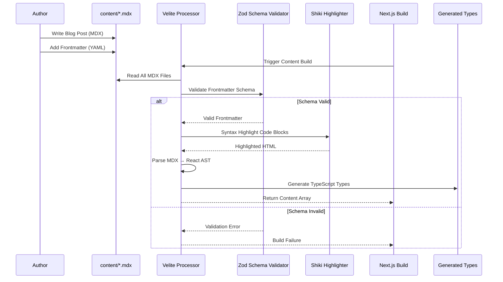
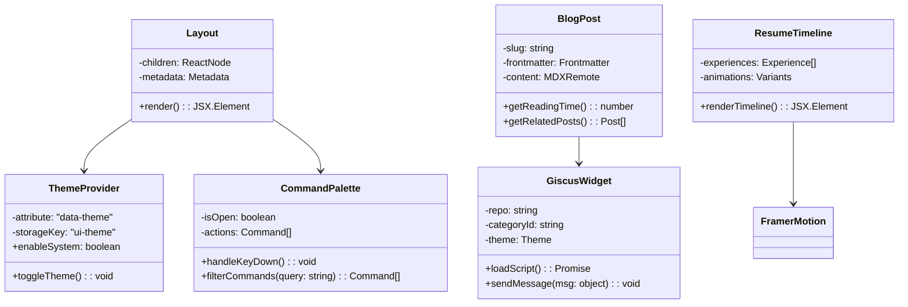
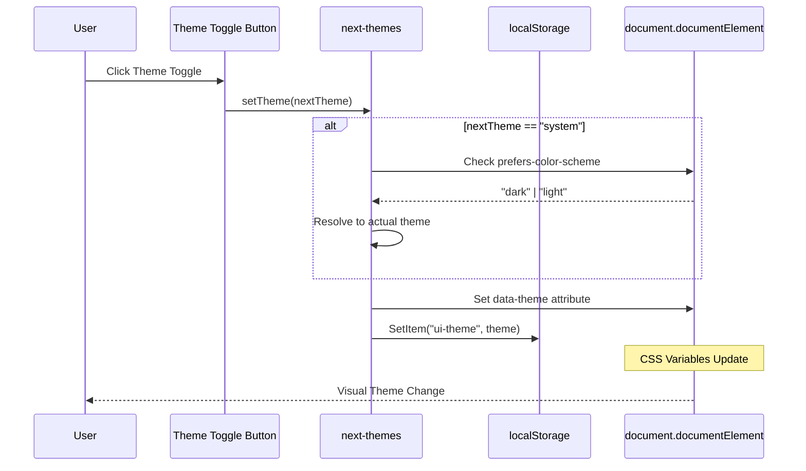
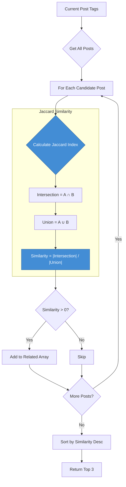
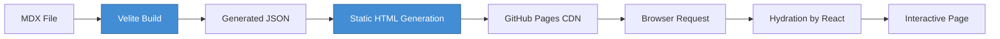
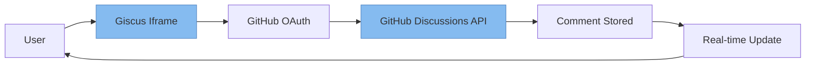

# Design Details

**Project:** Azhagu-swe Portfolio  
**Version:** 1.0.0  
**Last Updated:** 2026-02-20

---

## 1. High-Level Design (HLD)

### 1.1 Container Architecture

```mermaid
containerDiagram
    boundary "Portfolio Application" {
        Container(Next.js App Router, "Next.js 16 + React 19", "TypeScript")
        Container(Velite CMS, "Velite + Zod", "Content Pipeline")
        Container(Tailwind CSS, "Tailwind v3 + Framer Motion", "Styling & Animation")
    }

    boundary "External Dependencies" {
        Container_Ext_Giscus[Giscus React]
        Container_Ext_Radix[Radix UI Primitives]
        Container_Ext_Shiki[Shiki Syntax Highlighter]
    }

    Rel(Next.js App Router, Velite CMS, "Imports Generated Types")
    Rel(Next.js App Router, Tailwind CSS, "Applies Utility Classes")
    Rel(Next.js App Router, Container_Ext_Giscus, "Embeds Comment Widget")
    Rel(Next.js App Router, Container_Ext_Radix, "Composes Accessible Components")
    Rel(Velite CMS, Container_Ext_Shiki, "Uses for Code Highlighting")
```

### 1.2 Technical Boundaries

| Boundary | Technologies | Responsibility |
| :--- | :--- | :--- |
| **Presentation Layer** | React 19, Framer Motion, Tailwind CSS | UI rendering, animations, responsive design, theme switching |
| **Content Layer** | Velite, MDX, Rehype/Remark | Content ingestion, frontmatter parsing, MDX compilation |
| **Build Layer** | Next.js 16, TypeScript, ESLint | Static generation, type checking, linting, optimization |
| **Deployment Layer** | GitHub Actions, GitHub Pages | CI/CD pipeline, artifact deployment, CDN distribution |

---

## 2. Low-Level Design (LLD)

### 2.1 Content Processing Pipeline

The most complex logic in this system is the MDX content processing pipeline, which transforms markdown files into typed React components.



### 2.2 Frontmatter Schema (Zod)

```typescript
// lib/schemas.ts
import { z } from 'zod';

export const frontmatterSchema = z.object({
  title: z.string().min(1),
  description: z.string().min(1),
  date: z.string().regex(/^\d{4}-\d{2}-\d{2}$/),
  tags: z.array(z.string()).default([]),
  author: z.string().default('Alagappan P'),
  draft: z.boolean().default(false),
  coverImage: z.string().optional(),
});

export type Frontmatter = z.infer<typeof frontmatterSchema>;
```

### 2.3 Component Class Diagram



### 2.4 Theme Switching Sequence



### 2.5 Related Posts Algorithm (Jaccard Similarity)



**Implementation:**

```typescript
// lib/mdx.ts
function calculateJaccardSimilarity(tagsA: string[], tagsB: string[]): number {
  const setA = new Set(tagsA);
  const setB = new Set(tagsB);
  
  const intersection = new Set([...setA].filter(tag => setB.has(tag)));
  const union = new Set([...setA, ...setB]);
  
  if (union.size === 0) return 0;
  return intersection.size / union.size;
}

export function getRelatedPosts(currentPost: Post, allPosts: Post[], limit = 3): Post[] {
  return allPosts
    .filter(post => post.slug !== currentPost.slug)
    .map(post => ({
      ...post,
      similarity: calculateJaccardSimilarity(currentPost.frontmatter.tags, post.frontmatter.tags),
    }))
    .filter(post => post.similarity > 0)
    .sort((a, b) => b.similarity - a.similarity)
    .slice(0, limit);
}
```

---

## 3. Component Specifications

### 3.1 Command Palette (Cmd+K)

| Property | Value |
| :--- | :--- |
| **Trigger** | `Cmd+K` or `Ctrl+K` keyboard shortcut |
| **Data Source** | Static navigation items + dynamic blog posts |
| **Search Algorithm** | Fuzzy match using `cmdk` built-in filtering |
| **Accessibility** | WAI-ARIA combobox pattern with keyboard navigation |

### 3.2 Giscus Integration

| Property | Value |
| :--- | :--- |
| **Repository** | `azhagu-swe/azhagu-swe.github.io` |
| **Category** | `Comments` (ID: `DIC_kwDO...`) |
| **Theme Sync** | Mirrors next-themes context via postMessage |
| **Lazy Loading** | Component loaded only when visible (Intersection Observer) |

### 3.3 Resume Timeline

| Property | Value |
| :--- | :--- |
| **Animation Library** | Framer Motion |
| **Trigger** | Scroll into view (whileInView) |
| **Duration** | 0.6s ease-out |
| **Stagger** | 0.1s between items |

---

## 4. Data Flow Diagrams

### 4.1 Blog Post Rendering



### 4.2 Guestbook Comment Flow



---

## 5. Design Patterns

| Pattern | Usage |
| :--- | :--- |
| **Provider Pattern** | Theme context, MDX remote configuration |
| **Compound Components** | UI primitives (Card, CardHeader, CardContent) |
| **Render Props** | Framer Motion animation variants |
| **Singleton** | LocalStorage manager for theme persistence |
| **Factory** | Velite content type generators |

---

**See Also:**
- [Architecture Overview](./ARCHITECTURE.md)
- [ADR: Core Tech Choices](./adr/ADR-001-CORE-TECH-CHOICE.md)
- [API Specification](./API_SPEC.md)
