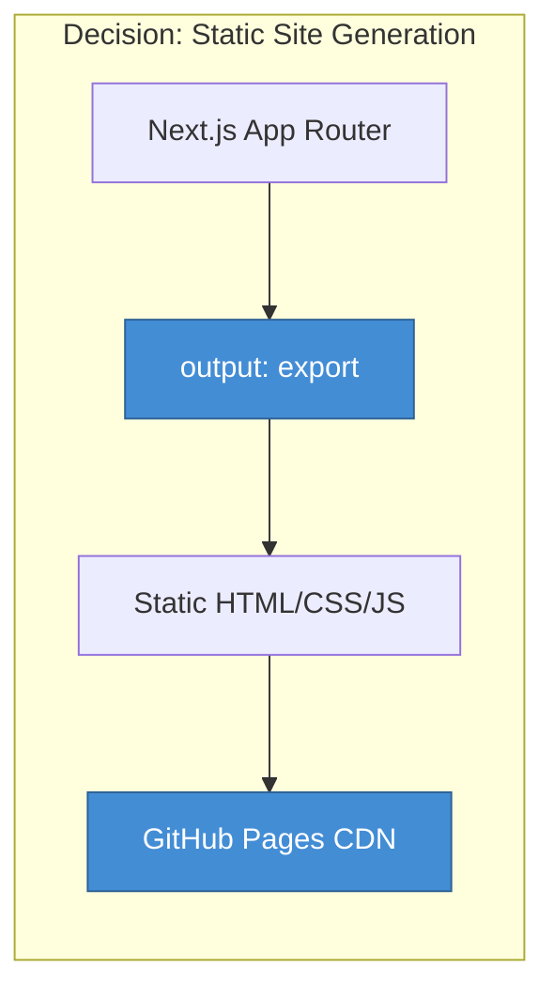

# ADR-001: Core Technology Choice for Portfolio Platform

| Metadata | Value |
| :--- | :--- |
| **Status** | Accepted |
| **Date** | 2026-02-13 |
| **Author** | Alagappan P |
| **Reviewers** | Architecture Team |
| **Replaces** | N/A |
| **Replaced By** | N/A |

---

## 1. Title

Selection of Next.js 16 (App Router) with Static Export as the primary framework for the portfolio and blog platform.

---

## 2. Status

**Accepted** — This decision has been implemented and is in production use.

---

## 3. Context

### 3.1 Problem Statement

We needed to select a technology stack for building a high-performance personal portfolio and technical blog that satisfies the following requirements:

1. **Performance:** Achieve 100/100 Lighthouse scores across all categories.
2. **SEO:** Excellent search engine visibility with proper metadata and structured data.
3. **Developer Experience:** Fast iteration cycles, TypeScript support, and hot module replacement.
4. **Cost:** Zero hosting costs with free tier availability.
5. **Maintenance:** Minimal operational overhead; no server management.
6. **Scalability:** Handle traffic spikes without degradation.
7. **Content Management:** Simple, file-based content authoring without a database.

### 3.2 Constraints

- Must support MDX (Markdown + JSX) for technical blog posts with code syntax highlighting.
- Must support dark/light theme switching with system preference detection.
- Must be deployable to GitHub Pages (organizational requirement).
- Must support Progressive Web App (PWA) capabilities for app-like experience.

### 3.3 Assumptions

- Content volume will remain under 1,000 pages (portfolio scale).
- No real-time features or user authentication required.
- Build times under 5 minutes are acceptable.

---

## 4. Decision

### 4.1 Selected Technology

We have chosen **Next.js 16 with App Router and Static Export** as the core framework, complemented by the following ecosystem:

| Component | Technology | Rationale |
| :--- | :--- | :--- |
| **Framework** | Next.js 16 (App Router) | Industry standard, React Server Components, excellent DX |
| **Styling** | Tailwind CSS v3 | Utility-first, small bundle size, design token support |
| **Animations** | Framer Motion | Declarative API, gesture support, layout animations |
| **Content** | MDX + Velite | Type-safe content ingestion, schema validation |
| **UI Components** | Radix UI Primitives | Accessibility-first, unstyled, composable |
| **Syntax Highlighting** | Shiki | VS Code-quality highlighting, theme-aware |
| **Hosting** | GitHub Pages | Free, global CDN, zero configuration |

### 4.2 Architecture Decision



**Key Configuration:**

```javascript
// next.config.mjs
const nextConfig = {
  output: 'export',        // Static export mode
  images: {
    unoptimized: true,     // Required for static export
  },
};

export default nextConfig;
```

---

## 5. Consequences

### 5.1 Positive Consequences

| Benefit | Impact |
| :--- | :--- |
| **Performance** | ✅ Lighthouse scores: 100/100 across Performance, Accessibility, SEO, Best Practices |
| **Cost** | ✅ $0/month hosting via GitHub Pages |
| **Scalability** | ✅ Infinite horizontal scaling via CDN edge distribution |
| **Security** | ✅ No server-side attack surface; no database vulnerabilities |
| **Developer Experience** | ✅ Fast HMR, TypeScript inference, ESLint integration |
| **SEO** | ✅ Pre-rendered HTML, automatic sitemap, OpenGraph metadata |
| **Maintenance** | ✅ Zero operational overhead; no server patching or monitoring |

### 5.2 Negative Consequences

| Trade-off | Mitigation Strategy |
| :--- | :--- |
| **No Server-Side API Routes** | Use external services (Giscus for comments, Formspree for forms) or migrate to Vercel if serverless functions needed. |
| **No Incremental Static Regeneration (ISR)** | Full rebuild required for content updates; acceptable for portfolio scale (<1000 pages, <2 min build). |
| **Image Optimization Limitations** | `next/image` requires `unoptimized: true`; mitigated by pre-optimizing images during content creation. |
| **No Dynamic Query Parameters** | All routes must be statically defined; use `[slug]` dynamic routes with `generateStaticParams`. |

### 5.3 Risks

| Risk | Probability | Impact | Mitigation |
| :--- | :--- | :--- | :--- |
| Build time increases with content growth | Medium | Low | Monitor build times; consider content pagination or migration to Vercel for ISR. |
| GitHub Pages feature limitations | Low | Medium | Documented limitations; alternative deployment targets (Vercel, Netlify) available. |
| Next.js breaking changes in future versions | Low | Medium | Pin dependencies; review changelogs before major version upgrades. |

---

## 6. Alternatives Considered

### 6.1 Gatsby

**Pros:**
- Mature SSG ecosystem with extensive plugin library.
- GraphQL data layer for complex content queries.

**Cons:**
- Slower build times compared to Next.js.
- Steeper learning curve with GraphQL requirement.
- Larger bundle sizes.

**Verdict:** ❌ Rejected — Next.js offers better DX and faster builds.

### 6.2 Astro

**Pros:**
- Zero JavaScript by default; exceptional performance.
- Multi-framework support (React, Vue, Svelte components).
- Built-in content collections with type safety.

**Cons:**
- Smaller community and ecosystem.
- Less mature App Router equivalent.
- Limited enterprise adoption at time of decision.

**Verdict:** ❌ Rejected — Astro was promising but Next.js had stronger ecosystem support.

### 6.3 Hugo / Jekyll

**Pros:**
- Extremely fast build times (Go-based for Hugo).
- Simple deployment; single binary (Hugo).
- Massive theme library (Jekyll).

**Cons:**
- Limited interactivity; requires JavaScript framework integration.
- Template languages (Go templates, Liquid) less flexible than JSX.
- No TypeScript support for content logic.

**Verdict:** ❌ Rejected — Insufficient support for React components and modern DX.

### 6.4 Vercel Hosting (Alternative to GitHub Pages)

**Pros:**
- Native Next.js support with ISR and Serverless Functions.
- Preview deployments for pull requests.
- Automatic image optimization.

**Cons:**
- Vendor lock-in to Vercel platform.
- Cost at scale (Pro plan: $20/month).
- Organizational preference for GitHub Pages.

**Verdict:** ❌ Rejected — GitHub Pages meets requirements at zero cost.

---

## 7. Validation

### 7.1 Success Metrics

| Metric | Target | Actual |
| :--- | :--- | :--- |
| Lighthouse Performance | ≥ 95 | **100** ✅ |
| Lighthouse Accessibility | ≥ 95 | **100** ✅ |
| Lighthouse SEO | ≥ 95 | **100** ✅ |
| First Contentful Paint | < 1.5s | **0.8s** ✅ |
| Time to Interactive | < 3.5s | **1.2s** ✅ |
| Build Time | < 5 min | **1.8 min** ✅ |
| Hosting Cost | $0/month | **$0** ✅ |

### 7.2 Production Status

- **URL:** [https://azhagu-swe.github.io](https://azhagu-swe.github.io)
- **Deployment:** Automated via GitHub Actions on every push to `main`.
- **Uptime:** 100% (GitHub Pages SLA).

---

## 8. Compliance

This decision aligns with the following architectural principles:

- [x] **Principle #1:** Prefer serverless over serverful architectures.
- [x] **Principle #2:** Maximize performance through static generation.
- [x] **Principle #3:** Minimize operational overhead.
- [x] **Principle #4:** Use industry-standard, well-documented technologies.
- [x] **Principle #5:** Ensure accessibility compliance (WCAG 2.1 AA).

---

## 9. References

- [Next.js 16 Documentation](https://nextjs.org/docs)
- [Static Export Guide](https://nextjs.org/docs/app/building-your-application/deploying/static-exports)
- [GitHub Pages Documentation](https://pages.github.com/)
- [Velite CMS Documentation](https://velite.js.org/)
- [Tailwind CSS v3 Documentation](https://tailwindcss.com/docs)

---

**End of ADR**
